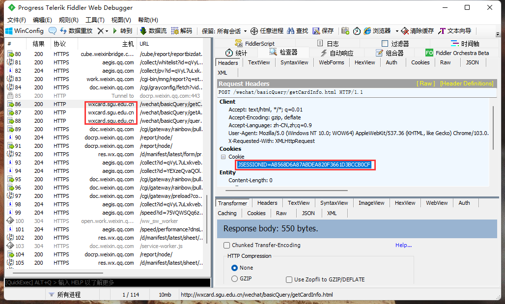

# 韶关学院水电费提醒脚本

## 目录

*   [关于](#关于)

    *   *   [功能](#功能)

*   [严肃警告](#严肃警告)

*   [配置文件](#配置文件)

*   [使用教程](#使用教程)

    *   [jar包版](#jar包版)
    *   [exe版](#exe版)

*   [故障排除](#故障排除)

# 关于

### 功能

1.  在水电费余额低于20元时，发送微信提醒给舍友（基础功能）

2.  周报功能，每周汇总水电费用量并通过微信发送提醒（可选开启）

3.  充值提醒功能，当用户充值完成后，脚本会通过微信发送消息给用户（可选开启）

# 严肃警告

*   该脚本纯属个人学习交流使用，不允许任何人使用本脚本非法获取各宿舍水电费，\*\*\*\*

# 配置文件

```.properties
room = 119    例如: 119
building = 丁香C栋   例如: 丁香C栋
adminUrl =  https://xizhi.qqoq.net/xxxxxx.send    管理员推送服务url，息知-单点推送
userUrl =  https://xizhi.qqoq.net/xxxxxx.channel    用户推送服务url，息知-频道推送
frequency = 600    监测费用间隔时间(秒)，推荐值600
errFrequency = 10    错误重连时间(秒)，推荐值10
waitTime = 10800    欠费信息推送后间隔时间(秒)，推荐值10800
feeUpEnable = true    是否开启充值提醒功能(填true或者false)
weekEnable = true    是否开启周报功能(填true或者false)
weekDay = 1    周报功能推送日期（1表示周日，2表示周一）
sessionId =  7BF0BB4CB2852??????233D03C9F6EBE    sessionId请自己爬取(sessionId可以查到自己的隐私信息，切勿流出)
```

*   adminUrl 以及userUrl 参数请使用息知的提醒，官网链接：[https://xz.qqoq.net/](https://xz.qqoq.net/ "https://xz.qqoq.net/")

*   room参数以你在企业微信查询电费时填写的房间号为准

*   building请使用以下字段

    *   海棠B栋

    *   碧桃24栋

    *   红棉西栋

    *   秋枫A栋

    *   紫荆B栋

    *   丁香A栋

    *   秋枫D栋

    *   碧桃28栋

    *   碧桂A栋

    *   丹竹A栋

    *   丹枫A栋

    *   丹桂22栋

    *   芙蓉D栋

    *   黄田坝9栋

    *   丹枫B栋

    *   芙蓉B栋

    *   红棉东栋

    *   黄田坝6栋

    *   碧桂C栋

    *   蔷薇C栋

    *   秋枫C栋

    *   黄田坝10栋

    *   丹桂26栋

    *   碧桃21栋

    *   秋枫B栋

    *   碧桂B栋

    *   蔷薇B栋

    *   紫薇A栋

    *   芙蓉A栋

    *   丹桂23栋

    *   海棠A栋

    *   紫藤1栋

    *   银杏A栋

    *   丁香D栋

    *   紫薇C栋

    *   碧桃27栋

    *   碧桃29栋

    *   丁香F栋

    *   丁香G栋

    *   红枫B栋

    *   紫薇B栋

    *   紫荆C栋

    *   银杏B栋

    *   丹竹B栋

    *   蔷薇A栋

    *   紫荆A栋

    *   梧桐苑栋

    *   海棠C栋

    *   紫竹A栋

    *   樱花苑栋

    *   碧桃20栋

    *   丁香B栋

    *   丁香E栋

    *   芙蓉C栋

    *   丁香C栋

    *   红枫A栋

    *   紫竹B栋

    *   丹竹C栋

    *   黄田坝12栋

    *   碧桃25栋

*   sessionId爬取教程

    首先下载Fiddler以及企业微信（PC）

    打开Fiddler开始捕获

    在企业微信中进入校园卡服务，查询一遍水电费，随便找到一个请求域名为`wxcard.sgu.edu.cn`，从请求头中即可找到`sessionId`

    

    **sessionId可以查到自己的隐私信息，包括本人身份证、信用卡余额、系别班级等，切勿流出**

    sessionId有有效期，一般20分钟左右无响应便会失效，但是当脚本运行时，会启动sessionId保活进程，于是只要脚本运行着，sessionId就不会失效，因此更需要注意sessionId不能流出，以及借用

# 使用教程

## jar包版

*   拥有jre环境

*   使用`java -jar xxxxx.jar`命令来启动脚本，注意：`fee.properties`配置文件必须与jar包在同一文件夹

*   使用jar包可以跨平台运行脚本，因此您可以将脚本挂在您装有jre的服务器上使用

## exe版

*   将`fee.properties`配置文件置于`SGU Water and Electricity Bill enquiry.exe`同一文件夹

*   双击exe文件运行即可

# 故障排除

有任何问题欢迎在Issues中提出，或者通过邮箱[rabig@foxmail.com](mailto:rabig@foxmail.com "rabig@foxmail.com")联系我
